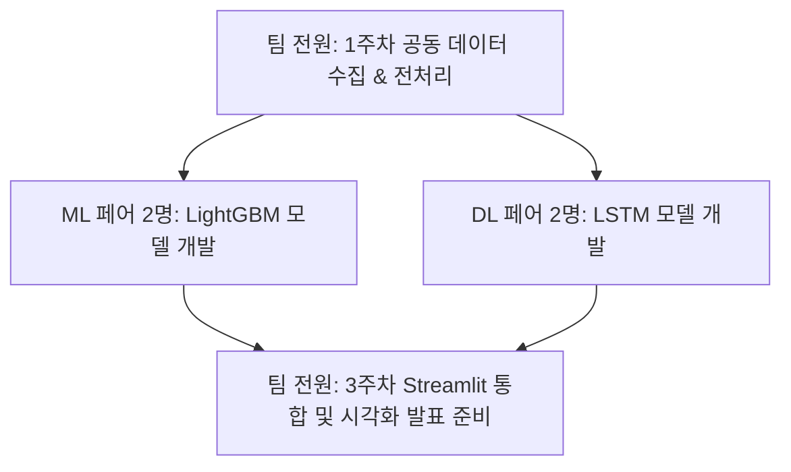

# 🚇 초보자 맞춤형 지하철 수요 예측 3주 팀 프로젝트 계획서

> **"10년 경력 지하철역 아저씨의 노하우를 4명의 초보 개발자가 AI로 가르치는 3주 여정"**

이 계획서는 인공지능과 데이터 분석을 처음 접하는 **4명의 팀원 모두가 중도 포기 없이 즐겁게 완주할 수 있도록** 난이도를 낮추고, 단계별로 함께 학습하며 성장하는 구조로 설계되었습니다.

---

## 📢 User Review Required (주요 설계 결정 사항)

> [!IMPORTANT]
> **데이터 범위 최적화: '서울 지하철 2호선' 전체 역 한정**
> - **배경**: 서울시 지하철의 모든 역(270여 개)의 1년 치 데이터를 사용하면 약 240만 행에 달해, 초보자용 로컬 PC 환경에서는 딥러닝(LSTM) 학습 시 메모리가 부족하거나 학습 시간이 하루 이상 걸릴 수 있습니다.
> - **결정**: 프로젝트 완성도와 속도를 위해, 서울 지하철 노선 중 가장 상징적이고 혼잡도가 높은 **'서울 지하철 2호선 전체 역(약 51개 역)'**으로 대상 범위를 한정합니다.
> - **효과**: 
>   1. **데이터 스케일 다운**: 1년 치 데이터가 **약 44만 행**으로 감소합니다. 이는 일반 노트북에서도 전처리 및 AI 학습이 수 분 내에 끝나는 아주 쾌적한 용량입니다.
>   2. **핵심 랜드마크 포함**: 강남역, 홍대입구역, 신도림역, 잠실역, 신촌역 등 지하철 혼잡의 대표역들이 모두 포함되어 있어 프로젝트 분석 가치가 충분합니다.
>   3. **시각화 완성도**: Streamlit UI 상에서 2호선 순환 노선도를 활용한 시각화나 분석 플로우를 더 깔끔하게 구성할 수 있습니다.

---

## 👥 4인 팀 역할 분담 & 공동 학습 전략
초보자일수록 혼자 개발하면 길을 잃기 쉽습니다. 따라서 **2인 1조 페어 프로그래밍(Pair Programming)** 형태로 짝을 지어 서로 코드를 리뷰하고 가르쳐주는 방식을 제안합니다.



### 🤝 페어(Pair) 구성 및 역할
*   **페어 1 (머신러닝 팀 - 2명)**:
    *   **임무**: 직관적이고 성능이 강력한 **LightGBM(스무고개 모델)**을 담당합니다.
    *   **학습 목표**: 의사결정나무(Decision Tree)의 원리를 이해하고, 날씨/공휴일 피처가 예측에 어떤 영향을 주는지 분석(Feature Importance)합니다.
*   **페어 2 (딥러닝 팀 - 2명)**:
    *   **임무**: 시간에 따른 흐름을 기억하는 **LSTM(순서 기억 모델)**을 담당합니다.
    *   **학습 목표**: 순환 신경망(RNN/LSTM)의 개념을 배우고, 연속적인 시간대별 승하차 흐름 패턴을 학습시킵니다.

---

## 📅 3주차 상세 로드맵 (Milestone)

### 🗓️ 1주차: 데이터 정복 및 전처리 (다 함께 기초 다지기)
*   **1~2일차: 파이썬 및 Pandas 기초 다지기 & 데이터 다운로드**
    *   서울시 지하철 2호선 승하차 데이터(CSV) 및 서울시 기상청 과거 날씨 데이터(CSV) 2025년 1년치 다운로드.
    *   *가이드*: 3년치(약 720만 행)는 초보자용 컴퓨터 환경에서 메모리 부족 오류(OOM)가 나거나 LSTM 학습에 수 시간이 소요될 수 있으므로, 최근 1년치(2호선 기준 약 44만 행)만 사용하는 것이 패턴 왜곡(코로나19 영향) 방지와 학습 효율성 면에서 가장 이상적입니다.
*   **3~4일차: 날짜 손질 및 공휴일 매핑**
    *   날짜 문자열에서 요일(월~일), 월(1~12월), 주말 여부를 파이썬 코드로 자동 추출하기.
    *   `holidays` 라이브러리를 사용해 달력에 빨간 날(공휴일)을 찾아 표시하기.
*   **5일차: 지하철 데이터 + 날씨 데이터 합치기 (Join)**
    *   "날짜"와 "시간"을 기준으로 두 데이터를 하나로 합쳐 `processed_data.csv` 만들기.

### 🗓️ 2주차: AI 모델 학습 및 성능 경쟁 (ML vs DL 페어 대항전)
*   **1~2일차: 기본 모델 뼈대 세우기**
    *   **ML 팀**: LightGBM을 설치하고 가장 단순한 예측부터 시작하기.
    *   **DL 팀**: TensorFlow/Keras로 아주 단순한 1층짜리 LSTM 모델을 만들고 작동하는지 확인하기.
*   **3~4일차: 모델 훈련 및 튜닝**
    *   **ML 팀**: 기온, 비여부, 공휴일 변수들을 입력하여 LightGBM 예측 오차 줄이기.
    *   **DL 팀**: 시퀀스 길이(과거 몇 시간을 볼 것인가)를 조절하며 LSTM 성능 튜닝하기.
*   **5일차: 성능 비교 워크샵**
    *   각자가 만든 모델에 동일한 테스트 데이터(예: 12월 데이터)를 넣어 평균 오차율(MAPE) 계산하기.

### 🗓️ 3주차: 대시보드 포장 및 발표 준비 (다 함께 마무리)
*   **1~2일차: Streamlit UI 뼈대 잡기**
    *   Streamlit의 기본 문법을 배우고 화면에 입력창(역 드롭다운, 날씨 선택 버튼 등) 만들기.
*   **3~4일차: 인터랙티브 그래프 추가 및 디자인 꾸미기**
    *   Plotly나 Matplotlib를 사용해 '24시간 예측 트렌드 그래프' 화면에 그리기.
*   **5일차: 최종 버그 수정 및 팀 프로젝트 발표자료(PPT) 작성**

---

## 🧹 막막함 해소를 위한 데이터 전처리 4단계 가이드라인

가장 까다로운 데이터 전처리 과정을 4개 단계로 나누어 설명합니다. 이 순서대로 코드를 한 줄씩 작성해 나가면 됩니다.

### 📊 데이터가 변환되는 모습 (Before & After)

*   **원본 승하차 데이터**:
    | 날짜 | 역명 | 호선 | 08시-09시 승차 | 09시-10시 승차 | ... |
    | :--- | :--- | :--- | :--- | :--- | :--- |
    | 2023-01-02 | 강남 | 2호선 | 32400 | 28100 | ... |

*   **전처리 후 모델 학습용 데이터**:
    | 날짜 | 역명 | 시간(Hour) | 승차인원 | 요일 | 월(Month) | 공휴일여부 | 기온 | 강수량 |
    | :--- | :--- | :--- | :--- | :--- | :--- | :--- | :--- | :--- |
    | 2023-01-02 | 강남 | 8 | 32400 | 0 (월) | 1 | 0 | 3.0 | 0.0 |
    | 2023-01-02 | 강남 | 9 | 28100 | 0 (월) | 1 | 0 | 3.2 | 0.0 |

---

### 🛠️ 단계별 전처리 세부 가이드 및 코드 예시

#### 1단계: 가로로 긴 승하차 데이터를 세로로 길게 풀기 (Melt)
공공데이터포털의 승하차 데이터는 시간별 컬럼(`06시-07시`, `07시-08시` 등)이 가로로 늘어서 있습니다. AI 모델에 학습시키려면 이를 세로형(tidy format)으로 변환해야 합니다.

```python
import pandas as pd

# 1. 데이터 로드
subway = pd.read_csv('data/raw/seoul_subway_2025.csv')

# 2호선 데이터만 필터링
subway_line2 = subway[subway['호선'] == '2호선']

# 2. 가로 데이터를 세로 데이터로 변환 (Melt)
# id_vars: 그대로 둘 컬럼들, value_vars: 세로로 녹일 컬럼들
subway_melted = pd.melt(
    subway_line2, 
    id_vars=['날짜', '역명', '호선'], 
    value_vars=['08시-09시 승차', '09시-10시 승차'], # 실제 데이터 컬럼명에 맞춤
    var_name='시간대', 
    value_name='승차인원'
)

# 3. '시간대' 문자열에서 숫자만 추출하기 (예: '08시-09시 승차' -> 8)
subway_melted['시간'] = subway_melted['시간대'].str.extract(r'(\d+)시').astype(int)
subway_melted = subway_melted.drop(columns=['시간대'])
```

#### 2단계: 날짜 데이터에서 달력 정보 추출하기 (Feature Engineering)
날짜 컬럼(`2023-01-02`)을 기준으로 요일, 월, 주말 여부, 한국 공휴일을 계산합니다.

```python
import holidays

# 1. 날짜 컬럼을 datetime 타입으로 변환
subway_melted['날짜'] = pd.to_datetime(subway_melted['날짜'])

# 2. 요일(0=월, 6=일) 및 월(1~12) 추출
subway_melted['요일'] = subway_melted['날짜'].dt.weekday
subway_melted['월'] = subway_melted['날짜'].dt.month
subway_melted['주말여부'] = subway_melted['요일'].apply(lambda x: 1 if x >= 5 else 0)

# 3. 한국 공휴일 라이브러리 정의
kr_holidays = holidays.KR()

# 4. 날짜가 공휴일인지 체크 (T/F -> 1/0)
subway_melted['공휴일여부'] = subway_melted['날짜'].apply(
    lambda x: 1 if x in kr_holidays else 0
)
```

#### 3단계: 날씨 데이터 정리하기 (Weather Data Alignment)
기상청에서 다운로드한 날씨 데이터(`weather.csv`)를 깨끗하게 정리합니다. 날씨 데이터에 결측치가 있을 경우 이전 시간대 값이나 평균값으로 채워줍니다.

```python
weather = pd.read_csv('data/raw/seoul_weather_2025.csv')

# 기상청 날짜를 datetime 형식으로 맞추기
weather['일시'] = pd.to_datetime(weather['일시'])

# 필요한 컬럼만 추출 (예: 일시, 기온(°C), 강수량(mm))
weather = weather[['일시', '기온(°C)', '강수량(mm)']]
weather.columns = ['날짜_시간', '기온', '강수량']

# 비가 안 오면 강수량 컬럼이 비어있으므로(NaN), 0.0mm로 채워줌
weather['강수량'] = weather['강수량'].fillna(0.0)
```

#### 4단계: 날짜와 시간을 기준으로 지하철과 날씨 합치기 (Merge)
두 테이블을 합치기 위해 승하차 데이터에 날씨 데이터의 '날짜_시간' 형태와 호환되는 매칭 키(Key)를 만들어 합쳐줍니다.

```python
# 1. 지하철 데이터에 날짜+시간 병합용 키 생성
# 날짜가 '2023-01-02'이고 시간이 8이면 -> '2023-01-02 08:00:00' 형태로 변환
subway_melted['날짜_시간'] = subway_melted['날짜'] + pd.to_timedelta(subway_melted['시간'], unit='h')

# 2. 두 데이터프레임을 '날짜_시간' 기준으로 결합 (Left Join)
final_df = pd.merge(subway_melted, weather, on='날짜_시간', how='left')

# 3. 필요 없는 임시 컬럼 정리 및 저장
final_df = final_df.drop(columns=['날짜_시간'])
final_df.to_csv('data/processed/final_dataset.csv', index=False)
```

---

## 🔎 검증 및 평가 계획 (팀 성과 지표)

### 1. 정량적 평가 (성능 비교)
- **베이스라인**: 단순 요일/시간별 평균값(이동평균) 대비 AI 모델의 예측이 얼마나 우수한지 오차율 비교.
- **평가 지표**: MAPE (Mean Absolute Percentage Error - 몇 %나 틀렸는가?)
  - *목표*: 초보자 기준 전체 평균 오차율 **15% 이하** 달성하기!

### 2. 정성적 평가 (UI/UX)
- 웹 화면에서 역 이름을 검색했을 때 1초 이내로 예측 그래프가 그려지는지 체크.
- 날씨 옵션을 '맑음'에서 '비'로 바꿀 때, 그래프 트렌드가 자연스럽게 변하는지 체크.
